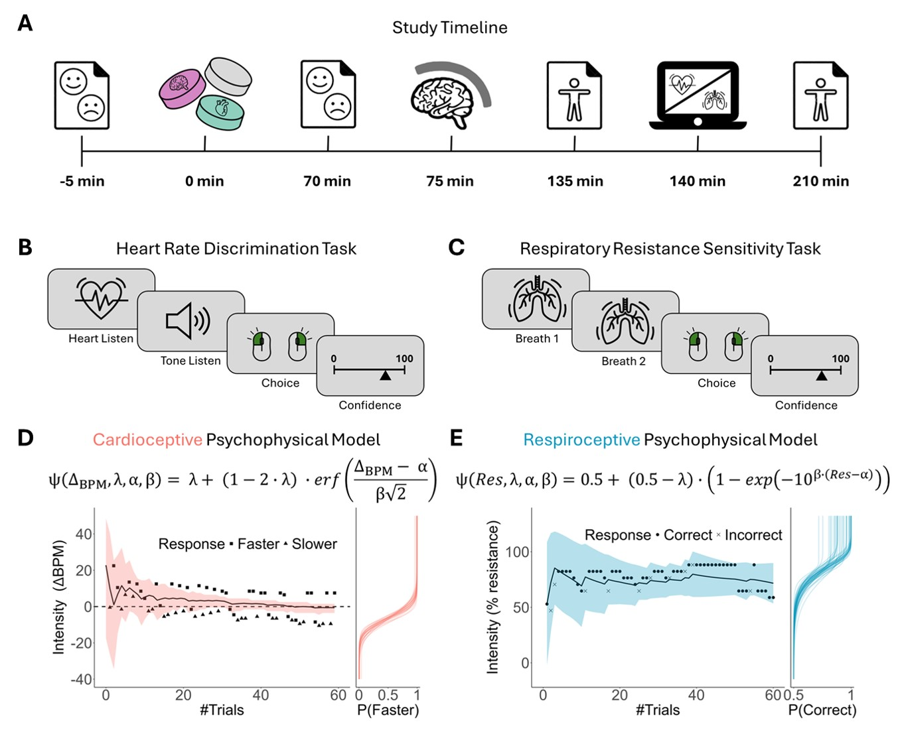
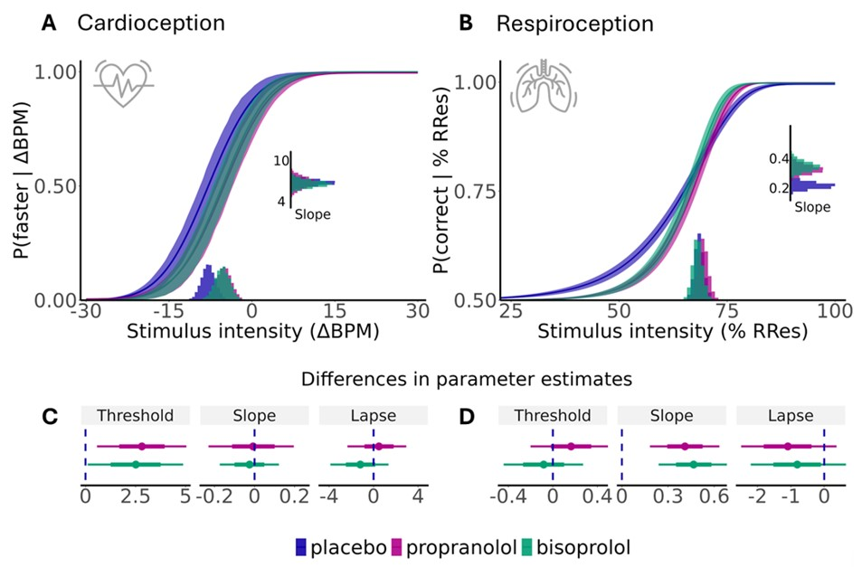
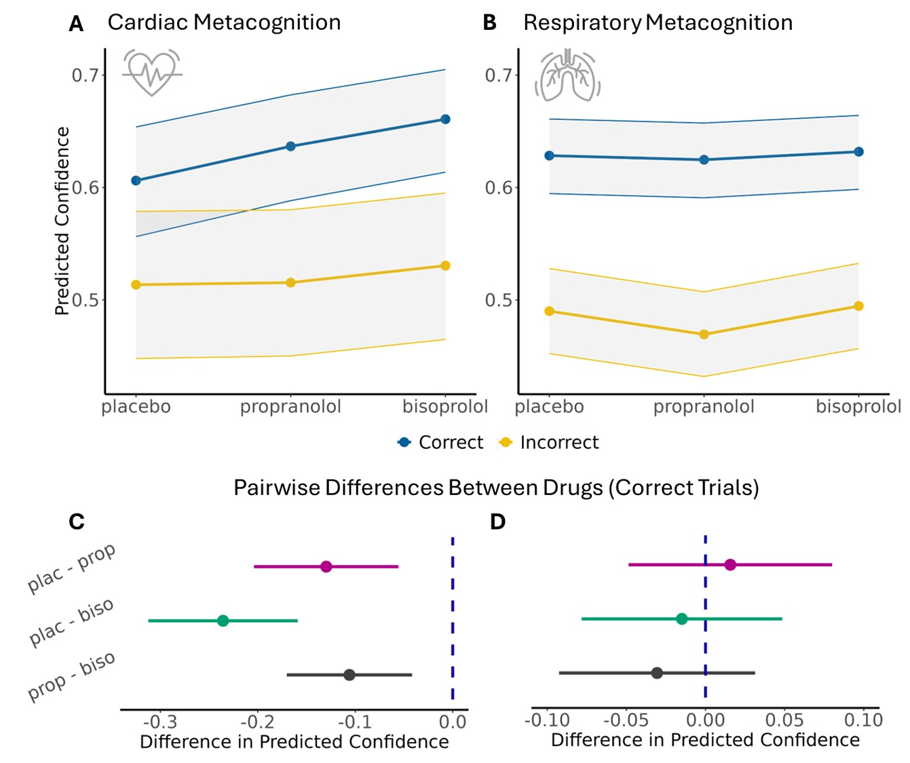

# Peripheral Beta-Blockade Differentially Enhances Cardiac and Respiratory Interoception

Ashley Tyrer, Jesper Fischer Ehmsen, Kelly Hoogervorst, Niia Nikolova, Victor Pando-Naude, Christian Holm Steenkjaer, Arthur S Courtin, Francesca Fardo, Tobias Hauser, Francesco Bavato, Micah Allen

---

## Abstract

Interoception, the perception of internal visceral states, arises from complex brain-body interactions involving the central and peripheral nervous systems. Despite noradrenaline’s key role in these interactions, its specific contribution to interoceptive processes remains unclear. In a placebo-controlled, randomised, within-subject study, we employed computational modelling of interoceptive psychophysics to determine how pharmacological beta-adrenoceptor antagonism controls interoception across cardiac and respiratory domains. Both cardio-selective bisoprolol and non-selective propranolol improved cardiac perceptual sensitivity, with bisoprolol exerting an enhanced effect on cardiac metacognition. In contrast, both beta-blockers increased respiratory perceptual precision, with no corresponding changes in sensitivity or metacognition. These findings reveal a novel dissociation between central and peripheral beta-adrenergic mechanisms in interoception, highlighting the pivotal role of peripheral noradrenaline in regulating multi-organ brain-body interactions. Our results suggest that beta-blockers may provide promising routes for modulating distinct facets of interoception, potentially opening new avenues for intervention in conditions characterised by disrupted bodily self-awareness.

---

## Preprint

Access the preprint here: [https://www.biorxiv.org/content/10.1101/2025.02.28.640776v1](https://www.biorxiv.org/content/10.1101/2025.02.28.640776v1)

---

## Citation

> Tyrer, A., Ehmsen, J.F., Hoogervorst, K., Nikolova, N., Pando-Naude, V., Steenkjær, C.H., Courtin, A.S., Fardo, F., Hauser, T., Bavato, F., Allen, M. (2025). Peripheral Beta-Blockade Differentially Enhances Cardiac and Respiratory Interoception. *bioarxiv*, 2025-02

## Figures

### Study Design and Multimodal Interoceptive Sensitivity Battery

### Psychophysical modelling of beta-blockade on cardioceptive and respiroceptive parameters

### Ordered Beta Regression of Metacognition in Interoceptive Tasks

## License

This project is licensed under the MIT License - see the [LICENSE](LICENSE) file for details.
